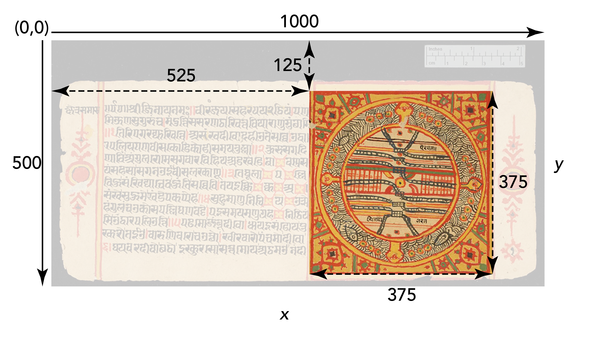
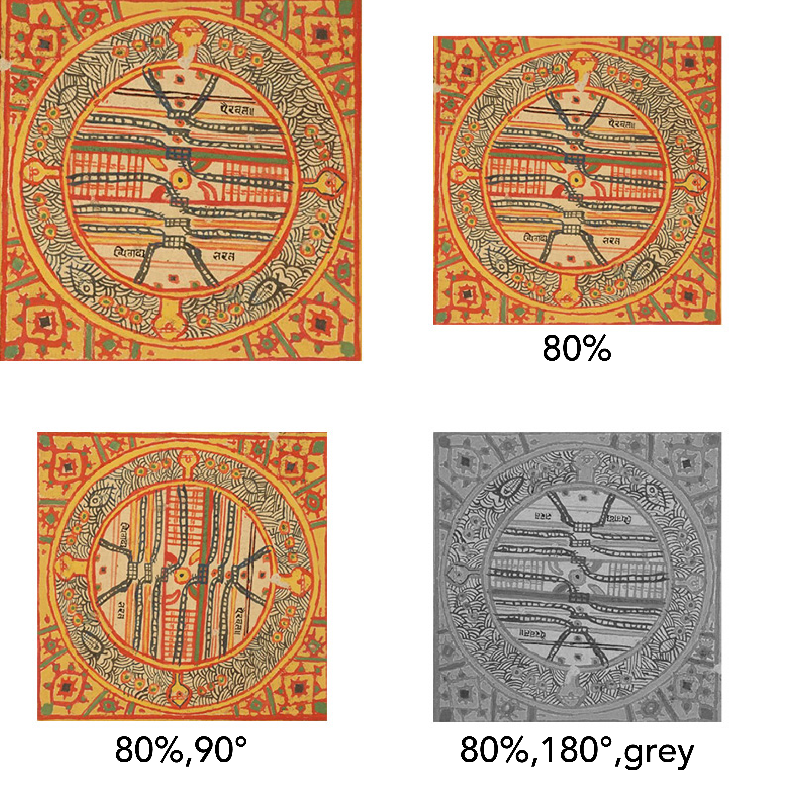

{fig-alt="The Labyriiinth Icon"}  

## Learning Objective

- Understand the Image API in order to know what a IIIF Image is.  
- Apply this knowledge in order to demonstrate you can retrieve a IIIF Image.    

::: {.callout-note collapse="true"}

## Key Tools and Concepts
Image API, 

:::

## Summary

Ok, so IIIF looks pretty useful - This step will allow you to start making sense of it. 

You are going to learn about the IIIF Image API, which is how to access and use an image made available through IIIF.

## Theory

You've probably heard a URL.
This will turn your world upside down, or at least the way you see images on the internet.

Think of an image as a map, and a URL as some co-ordinates on that map and instructions of how to find it.

This is an image of a page from a 1580 CE copy of a manuscript on Jain cosmology that was composed in the Prakrit language in the 14th century. Let's say the digital image measures 1000 pixels wide by 500 pixels high.

{fig-alt="Describe me..."}

On the page, there is a diagram of the 'Two and a Half Continents' (Aḍhāīdvīpa), a representation of the Jain understanding of the earthly realm. It shows lots of things you might expect to see on a map - oceans, continents, rivers and mountains.  

If I just want a square region showing only this diagram, I can use IIIF to get just the section I need by thinking of the pixels as co-ordinates. 

{fig-alt="Describe me..."}

The top-left corner of the image is always (0,0) and the region is defined using the top-left (x,y) co-ordinate followed by the width and height of the region you want.
So in this example, the co-ordinates for the region I want are (525,125,375,375).  

But that's not the only thing we can do. It's also possible to use the IIIF Image API to resize and rotate the image, and request different qualities or formats. These can be numerical or sometimes use words like 'full' or 'default'.

This image shows the original region, a reduction to 80%, an 80% reduction rotated 90°, and an 80% reduction rotated 180° in greyscale.

{fig-alt="Describe me..."}

So in this case, you really can turn the world upside down! Or make it greyscale if don't want a colourful world...

The full URI syntax template looks like this:  

> {scheme}://{server}{/prefix}/{identifier}/{region}/{size}/{rotation}/{quality}.{format}

## Example

::: {.callout-caution collapse="true"}
## To Do in Future

Build interactive OJS Viewer.
:::

## Exercise
1. Find an image you want to use.
	* In a new tab, go to this Mixtape of [IIIF Examples](https://tripleyefish.com/mixtape/A8FTo0OtA1vSjsb4Cr4Tx6c9X8M2D25UhzixDJcu/edit).
	* Choose one that looks interesting.
	* Click to the 'Crop' icon underneath the resource you've chosen.		
	* A new window will open that shows all the available images/pages as thumbnails.
	* Find one you want to use and click on it.
	* In the box immediately above the thumbnails you will see a URL and a 'copy' button.
	* Click the 'copy' button, open a new web-browser tab and paste it into the address/URL bar and press return/enter.
	* You should see your image load.	  		

2. Take a look at the URL and you'll notice some familiar syntax.

3. Play with some of these values in the URL, hit enter, and see what happens.
	
4. Try changing the following: 
	* Find a region you like
	* Change the size
	* Rotate the image
	* Make it grey or bitonal

5. Once you are happy with the way your image looks, record your results for your journal by taking a screenshot of you web-browser tab, making sure to include the image and its URL. Make ure you remember where your screenshot is saved, and you can uplaod this to your [Workbench](https://workbench.gdmrdigital.com/).   

::: {.callout-tip collapse="true"}
## Top Tip!

When you are adding images to your own website (eg Drupal/Wordpress), you could use the IIIF Image API to add the image/crop you want by using these URLs instead of cropping and uploading a new image.  

However... there's also a better way - you could embed a zooming IIIF viewer like [Universal Viewer](https://universalviewer.io/) to show ANY IIIF resource in all its glory.

There's a few hints and wrinkles when doing this - ie wathc out for 'content state' - regions in the embed code that can help/hinder. AND sometime the canvase ID is one out if the sequence starts with 0 instead of 1.

:::