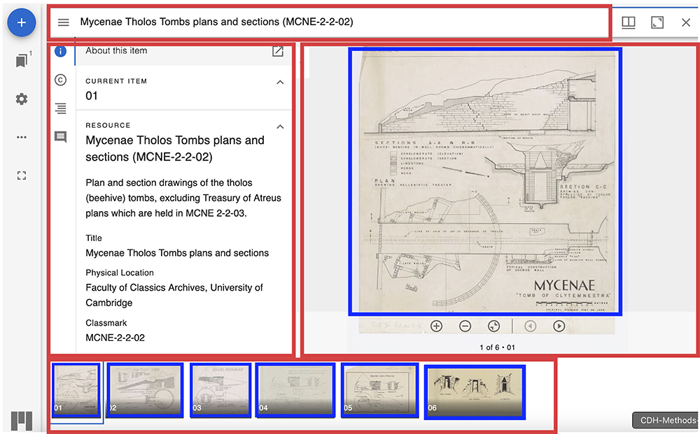

{fig-alt="The Labyriiinth Icon"}  

## Learning Objective

* Understand the Presentation API in order to know how a digital representation of an object is constructed/structured.     
* Apply this knowledge in order to discover new resources.    

::: {.callout-note collapse="true"}

## Key Tools and Concepts
Exhibit, IIIF Manifest

:::

## Summary

So you've gotten to grips with the IIIF Image API. Well Done!
But how are individual images combined with metadata in order to present complete digital objects? 

## Theory

What is a IIIF Manifest and what are its components?

{fig-alt="A diagram demonstrating the IIIF Presentation API structure."} 

Blue = Image data - using the Image API.

Red = The structure: Title/metadata/sequence  - using the Presentation API. 

<iframe src="https://uv-v4.netlify.app/uv.html#?manifest=https%3A%2F%2Fcudl.lib.cam.ac.uk%2F%2Fiiif%2FMS-CLASSICS-MCNE-00002-00002-00002&c=0&m=0&cv=1&config=&locales=en-GB%3AEnglish+%28GB%29%2Ccy-GB%3ACymraeg%2Cfr-FR%3AFran%C3%A7ais+%28FR%29%2Cpl-PL%3APolski%2Csv-SE%3ASvenska&r=0" width="100%" height="500" allowfullscreen frameborder="0" title="Mycenae Tholos Tombs plans and sections (MCNE-2-2-02)"></iframe>

```{mermaid}
flowchart TD
  A[Manifest] --> B[Sequence]
  B --> C{Canvas}
  C --> D(Content A One)
  C --> E(Content B Two)
```

How do I find IIIF Manifests?
Look for the logo, or their sometimes hidden in 'use' or 'share' options.
It's tricky because everyone does it slightly differentl, and often with good reason. So learning how to find them is a skill.

The IIIF Community have prepared [Guides to finding IIIF resources](https://iiif.io/guides/finding_resources/)


## Exercise

Pick one of the [Guides to finding IIIF resources](https://iiif.io/guides/finding_resources/) and see if you can find a manifest for a IIIF resource.

Edit a manifest:
Using the [Digirati Manifest Editor](https://manifest-editor.digirati.services). 

