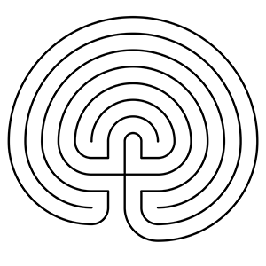

{fig-alt="The Labyriiinth Icon"}  

## Learning Objective
Remember what you have learned in order to reflect on it and revaluate your understanding of interoperability.  

::: {.callout-note collapse="true"}

## Key Tools and Concepts
Exhibit, IIIF Manifest

:::

## Summary

## Exercise

If we have time, We can go into the [Anaverse](Anaver.se)... 

